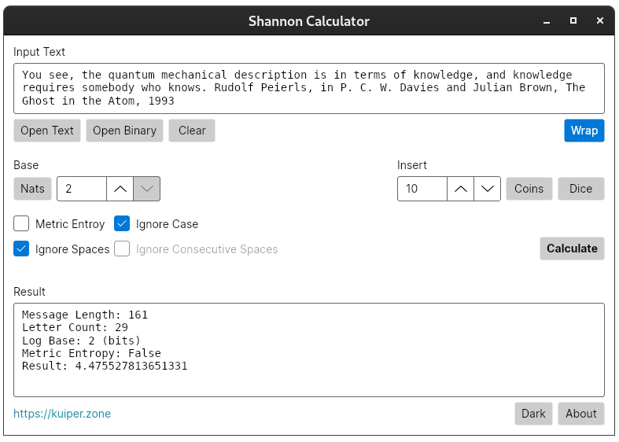

# Shannon Calculator #

**Shannon Calculator** is a cross-platform application which calculates the Shannon self-information content
of a message text or file byte data.

It is written in C# using the [Avalonia XAML Framework](https://avaloniaui.net/), and is licensed under GPLv3.

Shannon Calculator is available as AppImage and Flatpak for Linux. It is also available as a simple zip file
for Windows. In the case of the latter, unzip the file and run the `ShannonCalculator.exe` file.

[**DOWNLOAD RELEASE**](https://github.com/KuiperZone/Shannon-Calculator/releases/latest)

Don't forget to set the "Execute" permission for AppImage on Linux.

For latest information, see: https://kuiper.zone/shannon-calculator-avalonia

## Shannon Information ##
Shannon information is a measure of the information content contained in a message. The theory underpins many
developments in compression, message transmission and error correction.

For a somewhat detailed introduction, try: [Information Theory and the Digital Age](https://web.mit.edu/6.933/www/Fall2001/Shannon2.pdf)

There were two motivations for this project. First and foremost, I became interested in the philosophical
nature of information, rather than its engineering application.

## Avalonia Framework for .NET ##
The other reason for the project was that it serve as a test-bed for Avalonia. As I've switched my personal computing
platform to Linux recently, I was interested to try out a .NET GUI framework that, unlike WPF, will run anywhere.

See also Avalonia on [github](https://github.com/AvaloniaUI/Avalonia).

Don't forget to like (star) and share this project (but only if *you do like it* of course).
